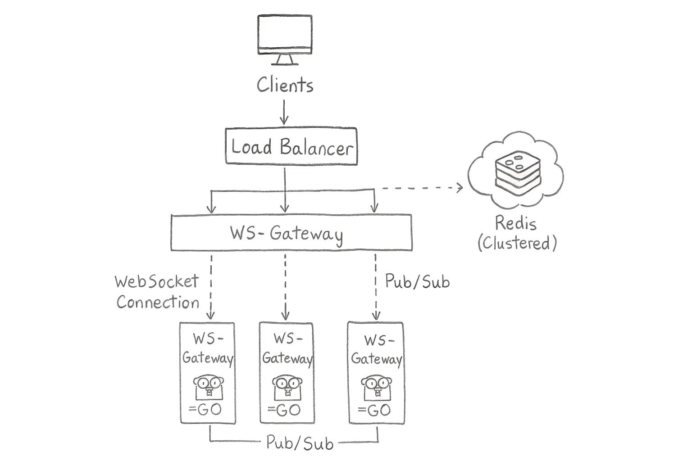

# go-ws-gateway

A service for processing WebSocket connections

---

## Table of Contents
- [Project Description](#project-description)
- [Project Structure](#project-structure)
- [Installation and Launch](#installation-and-launch)
  - [Local Development](#local-development)
  - [Docker](#docker)
  - [Kubernetes](#kubernetes)
- [Configuration](#configuration)
- [API and WebSocket](#api-and-websocket)
  - [WebSocket Connection](#websocket-connection)
  - [Connection Parameters](#connection-parameters)
- [Metrics](#metrics)
  - [Prometheus Integration](#prometheus-integration)
- [License](#license)

---



---

## Project Description

Go WebSocket Gateway is a service that provides a WebSocket interface for clients and processes messages through Kafka. The service is designed to ensure real-time two-way communication between clients and the backend system.

---

## Project Structure

```
go-ws-gateway/
├── cmd/                   # Application entry points
│   └── ws-gateway/        # Main service
│       ├── commands/      # CLI commands (Cobra)
│       └── main.go        # Entry point
├── internal/              # Application-specific internal code
│   ├── repository/        # Data access layer
│   └── service/           # Business logic
├── kubernetes/            # Kubernetes configuration
├── pkg/                   # Reusable packages
│   ├── config/            # Application configuration
│   ├── handlers/          # HTTP and WebSocket handlers
│   ├── kafka/             # Kafka integration
│   ├── metrics/           # Prometheus metrics
│   ├── models/            # Data models
│   ├── redis/             # Redis integration
│   └── websocket/         # WebSocket connection management
├── config.yaml            # Configuration example
├── Dockerfile             # Docker image build instructions
├── go.mod                 # Go dependencies
├── go.sum                 # Dependency hashes
├── LICENSE                # Project license
├── Makefile               # Build and deployment commands
└── README.md              # Project documentation
```

---

## Installation and Launch

### Local Development

1. Clone the repository:
   ```bash
   git clone https://github.com/anatoly-dev/go-ws-gateway.git
   cd go-ws-gateway
   ```

2. Install dependencies:
   ```bash
   go mod download
   ```

3. Start the service:
   ```bash
   go run cmd/ws-gateway/main.go serve
   ```

### Docker

Build and run using Docker:

```bash
# Build the image
docker build -t go-ws-gateway .

# Run the container
docker run -p 8080:8080 -v $(pwd)/config.yaml:/app/config.yaml go-ws-gateway
```

### Kubernetes

For deployment in Kubernetes:

```bash
kubectl apply -f kubernetes/
```

---

## Configuration

The service is configured through `config.yaml` and environment variables:

```yaml
server:
  port: 8080
  readTimeout: 10s
  writeTimeout: 10s

kafka:
  bootstrapServers: localhost:9092
  groupId: ws-gateway
  topics:
    - balance-updates
    - user-blocks
    - notifications

redis:
  addr: localhost:6379
  password: ""
  db: 0

logger:
  level: info
  format: json

metrics:
  enabled: true
  namespace: ws_gateway
  path: /metrics
```

---

## API and WebSocket

### WebSocket Connection

To connect to the WebSocket API:

```
ws://hostname:8080/ws
```

### Connection Parameters

- `token` - JWT token for authentication
- `topics` - list of topics to subscribe to (comma-separated)

URL example:
```
ws://localhost:8080/ws?token=your-jwt-token&topics=balance-updates,notifications
```

---

## Metrics

The service provides a wide range of Prometheus metrics to monitor all aspects of its work.

A complete list of all available metrics with descriptions is located in [pkg/metrics/README.md](pkg/metrics/README.md).

### Prometheus Integration

Metrics are exposed on the `/metrics` endpoint (configurable in `config.yaml`). You can scrape this endpoint with Prometheus server.

Example Prometheus configuration:

```yaml
scrape_configs:
  - job_name: 'ws-gateway'
    scrape_interval: 10s
    static_configs:
      - targets: ['ws-gateway:8080']
```

Example Grafana dashboard query for active WebSocket connections:
```
sum(ws_gateway_websocket_active_connections)
```

---

## License

[MIT License](LICENSE)
